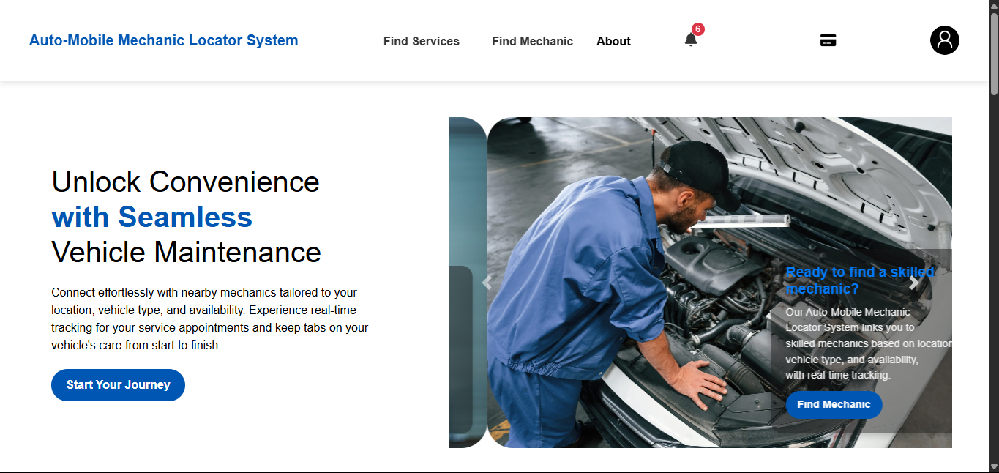
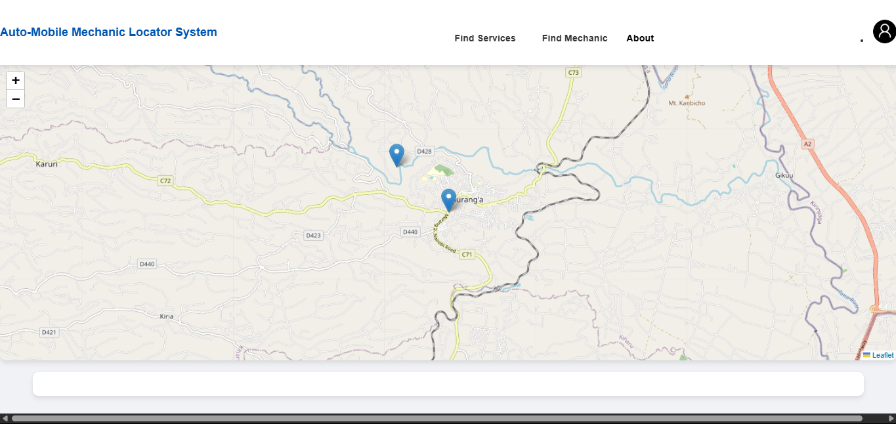
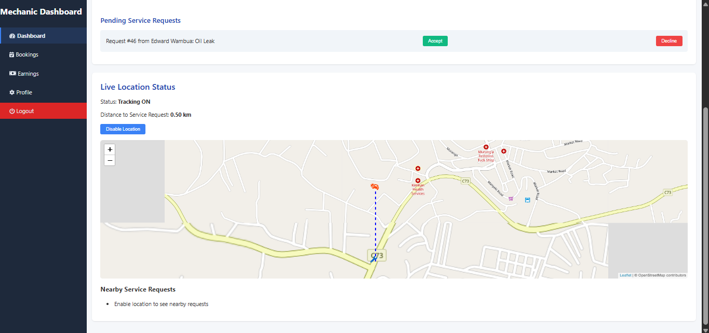
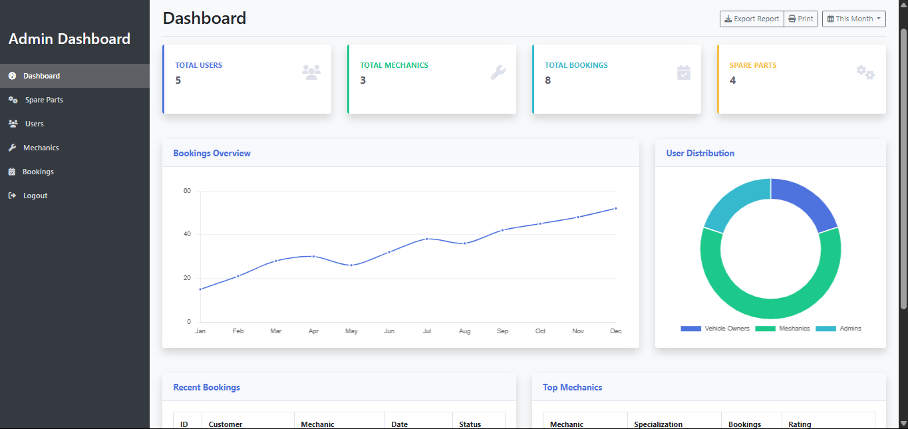

# 🚗 Auto-Mobile Locator System with GIS Integration

A full-stack, GIS-enabled web platform designed to help vehicle owners easily locate nearby, reliable mechanics — especially during roadside breakdowns. This system leverages real-time GPS mapping, user-centered design, and modular dashboards tailored to vehicle owners, mechanics, and administrators.

---

## 📌 Project Overview

This project was developed to address key challenges faced by drivers in locating roadside mechanical assistance. It integrates location-based services with modern web technologies to provide real-time mechanic availability, user-friendly interfaces, and efficient service request management.

---

## 🛠️ Tech Stack

- **Frontend**: HTML, CSS, JavaScript 
- **Backend**: Node.js / Express.js
- **Database**: MySQL
- **GIS Mapping**: Leaflet.js + OpenStreetMap
- **Authentication**: JWT or session-based auth
- **Other Tools**: Sequelize ORM, Git, Vite/Webpack

---

## 🔐 Security & Usability

- Secure role-based access control (RBAC)
- Responsive design for mobile and desktop
- Feedback mechanisms for real-time user interaction

---

## ✅ Outcome

All project objectives were successfully met. The final system provides a practical and scalable solution for improving roadside mechanical assistance through GIS integration, responsive design, and real-time functionality.

---

## 📷 Screenshots

### Home Page for Vehicle owner(customer)

### 📍 Mechanic Locator Map

### 🔧 Mechanic Dashboard View

### Admin Dashboard

---

## 🧪 Testing

- Unit Testing  
- Integration Testing  
- User Acceptance Testing (UAT)  

---